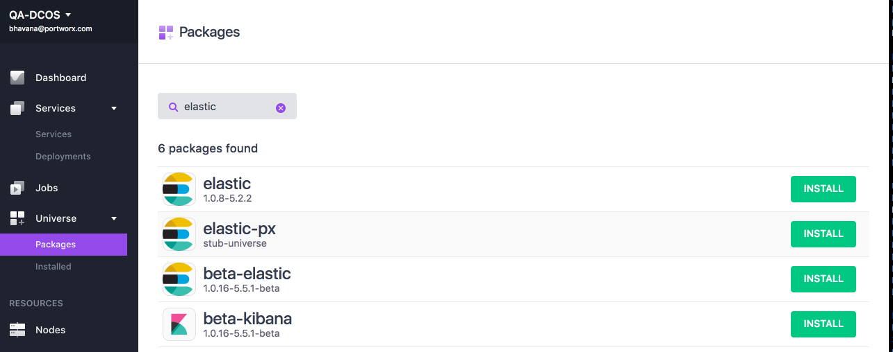
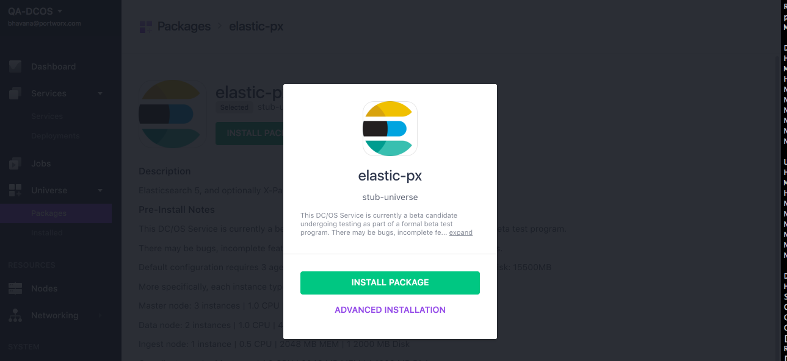
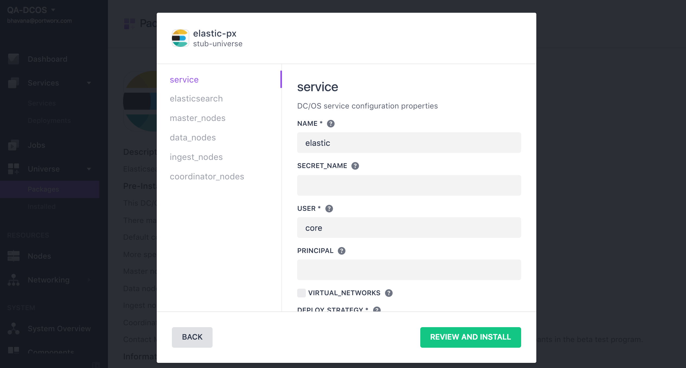
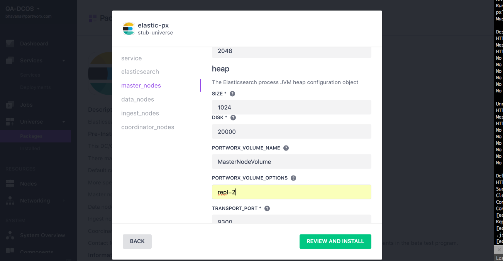
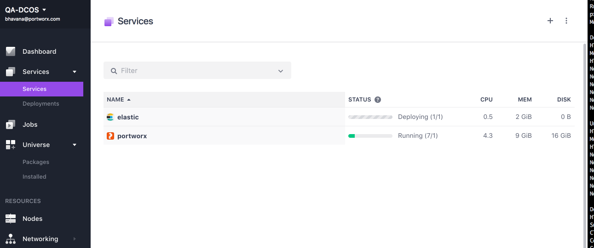
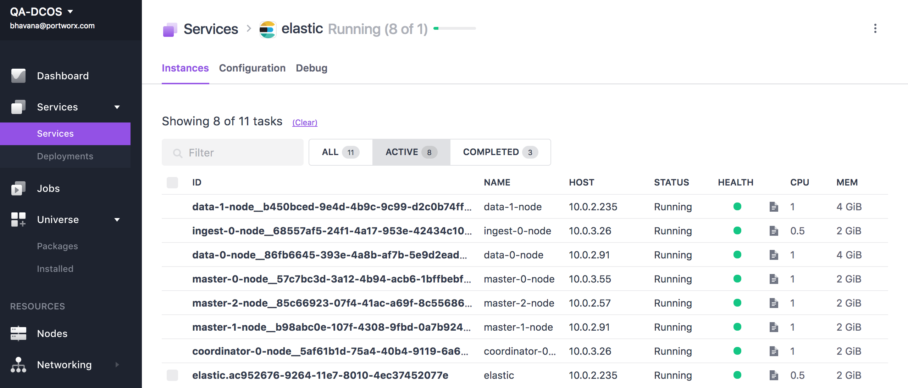
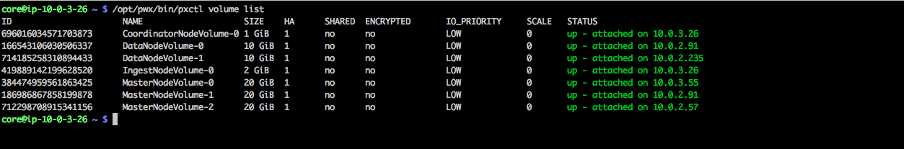

The following instruction will install Elasticsearch service on DC/OS cluster backed by PX volumes for persistent storage.

Please review the main [Portworx on DCOS](https://docs.portworx.com/scheduler/mesosphere-dcos/) documentation.

# Prerequisites

- A running DC/OS v1.9 cluster with at least 3 private agents with Portworx running on all three
- Portworx works best when installed on all nodes in a DC/OS cluster.  If Portworx is to be installed on a subset of the cluster, then:
  * the agent-nodes must include attributes indicating the participate in the Portworx cluster.
  * services that depend on Portworx volumes must specify "constraints" to ensure they are launched on nodes that can access Portworx volumes.
- A node in the cluster with a working DC/OS CLI.

# Install Elasticsearch
## Adding repository to DC/OS cluster
Login to a node which has the DC/OS CLI installed and is authenticated to the DC/OS cluster
Run the following command to add the repository to the DC/OS cluster
```
 $ dcos package repo add --index=0 elastic-px https://px-dcos.s3.amazonaws.com/v1/elastic/elastic.zip
 ```
Now elastise-PX package should be available under Universe->Packages

## Default Install
If you want to use the defaults, you can now run the dcos command to install the service
```
 $ dcos package install --yes elastic-px
```
You can also click on the “Install” button on the WebUI next to the service and then click “Install Package”.

## Advanced Install
If you want to modify the defaults, click on the “Install” button next to the package on the DC/OS UI and then click on
“Advanced Installation”

This provides an option to change the service name, volume name, volume size, and provide any additional options that needs to be passed to the docker volume driver.
The default number of master_node count is 3 and this is not changeable. The default number of data_nodes count is 2. The default count for ingest_nodes and coordinator_nodes is 1.


Click on “Review and Install” and then “Install” to start the installation of the service.
## Install Status
Click on the Services page to monitor the status of the installation.

Elasticsearch service is ready to use when the scheduler service and all the elastic services are in running state.

Checking the Portworx's cluster will list multiple volumes that were automatically created using the options provided during install.


## Verifying Instalation
Install Elasticsearch CLI using the following command on DC/OS client
```
  $ dcos package install elastic-px --cli
```
Find the elastic search master-http endpoint from DCOS workstation


Connect to the master node and check the cluster status
```
$ dcos node ssh --master-proxy --leader
```


# Further resource
For more detailed description on using Portworx through DCOS please visit  [Portworx on DCOS framework homepage](https://docs.portworx.com/scheduler/mesosphere-dcos)
