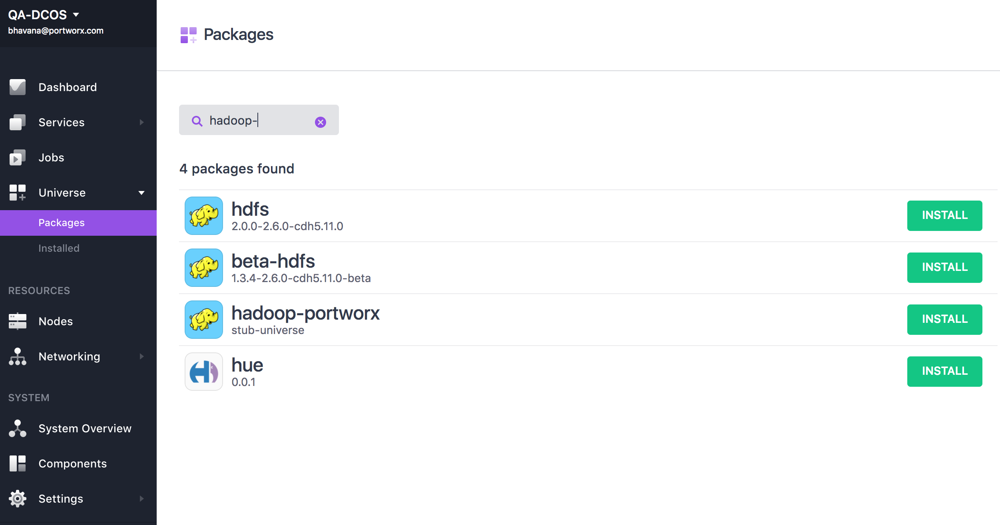
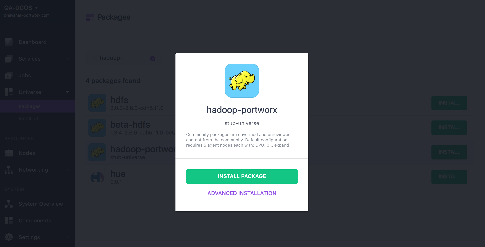
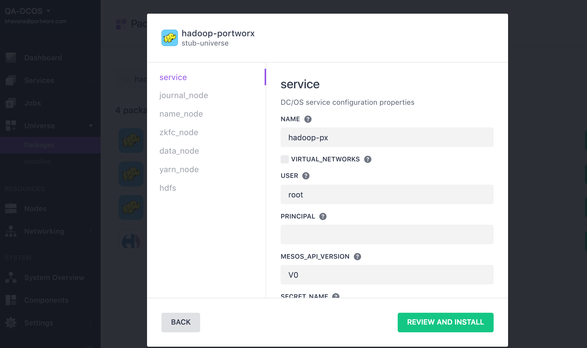
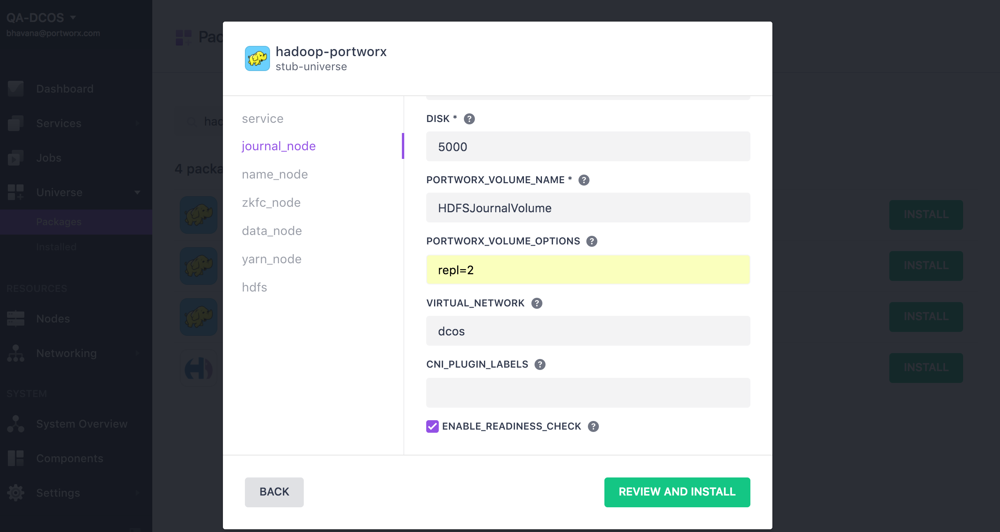
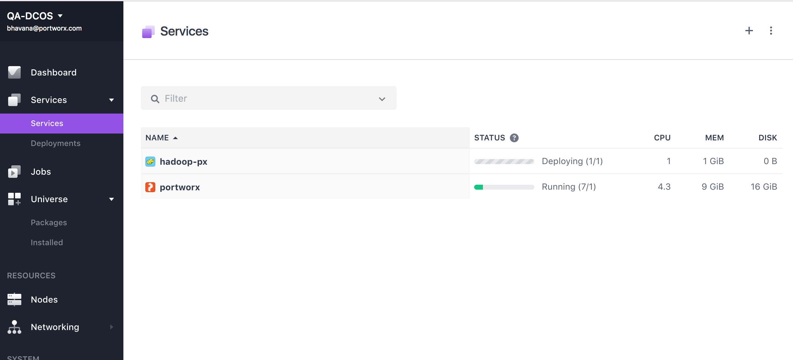
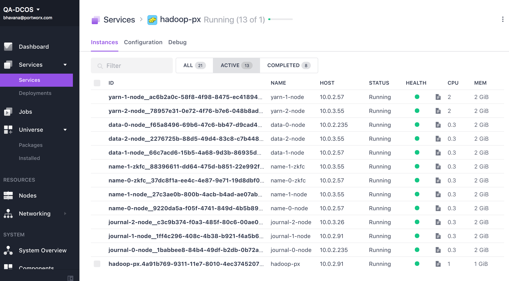

The following instruction will install Hadoop service on DC/OS cluster backed by Portworx volumes for persistent storage.


# Prerequisites

- A DC/OS v1.9 cluster with Portworx installed on at least 3 private agents.
- Portworx works best when installed on all nodes in a DC/OS cluster. If Portworx is to be installed on a subset of the cluster, then constraints must be used to specify the nodes where Portworx is installed.
- A node in the cluster with a working DC/OS CLI.

Please review the main [Portworx on DCOS](https://docs.portworx.com/scheduler/mesosphere-dcos/) documentation.

# Install Hadoop
 portworx-hadoop package should be available under Universe->Packages

## Default Install
If you want to use the defaults, you can now run the dcos command to install the service
```
 $ dcos package install --yes portworx-hadoop
```
You can also click on the  “Install” button on the WebUI next to the service and then click “Install Package”.
It will create 3 Journal Nodes, 2 Name Nodes, 2 Nodes for the Zookeeper Failover Controller, 3 Data Nodes and 3 Yarn Nodes.
The Data and Yarn nodes will be co-located on the same physical host.

## Advanced Install
If you want to modify the defaults, click on the “Install” button next to the package on the DC/OS UI and then click on
“Advanced Installation”

This provides an option to change the service name, volume name, volume size, and provide any additional options that needs to be passed to Portworx volume.
You can also configure other Hadoop related parameters on this page including the number of Data and Yarn nodes for the Hadoop clsuter.


Click on “Review and Install” and then “Install” to start the installation of the service.
## Install Status
Click on the Services page to monitor the status of the installation.

There will be one service for the scheduler and one each for the Journal, Name, Data and Yarn nodes.

Checking the Portworx's cluster will list multiple volumes that were automatically created using the options provided during install.
On the Portworx cluster, you should see multiple volumes that were automatically created using the options provided during install, one for each of the Journal, Name and Data nodes.


Install Hadoop CLI using the following command on DC/OS client
```
$ dcos package install portworx-hadoop --cli
Installing CLI subcommand for package [portworx-hadoop] version [stub-universe]
New command available: dcos portworx-hadoop
```
# Further resource

For more detailed description on using Portworx through DCOS please visit  [Portworx on DCOS framework homepage](https://docs.portworx.com/scheduler/mesosphere-dcos)
