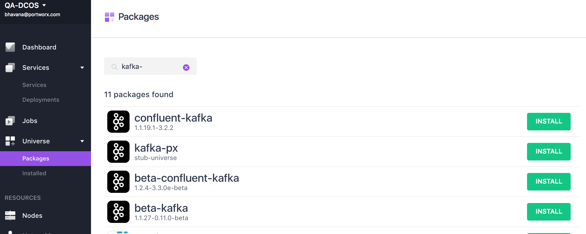
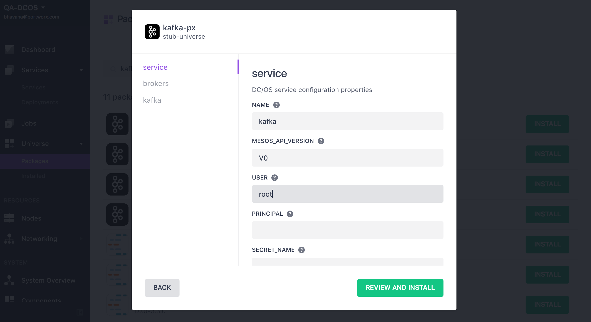
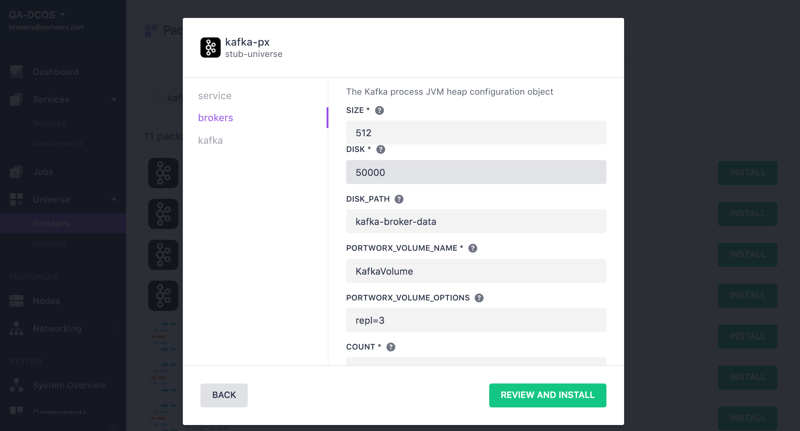

* The following instruction will install Kafka service on DC/OS cluster backed by PX volumes for persistent storage.

Please review the main [Portworx on DCOS](https://docs.portworx.com/scheduler/mesosphere-dcos/) documentation.

# Prerequisites

- A running DC/OS v1.9 cluster with at least 3 private agents with Portworx running on all three
- Portworx works best when installed on all nodes in a DC/OS cluster.  If Portworx is to be installed on a subset of the cluster, then:
  * the agent-nodes must include attributes indicating the participate in the Portworx cluster.
  * services that depend on Portworx volumes must specify "constraints" to ensure they are launched on nodes that can access Portworx volumes.
- All nodes in the cluster that will participate in a Portworx cluster MUST have a separate non-root volume to use.
- A node in the cluster with a working DC/OS CLI.

# Install Kafka
## Adding repository to DC/OS cluster
Login to a node which has the DC/OS CLI installed and is authenticated to the DC/OS cluster
Run the following command to add the repository to the DC/OS cluster
```
 $ dcos package repo add --index=0 kafka-px https://px-dcos.s3.amazonaws.com/v1/kafka/kafka.zip
```
Now Kafka-PX package should be available under Universe->Packages

## Default Install
If you want to use the defaults, you can now run the dcos command to install the service
```
 $ dcos package install --yes kafka-px
```
You can also click on the  “Install” button on the WebUI next to the service and then click “Install Package”.
This will install all the prerequisites and start the Kafka service on 3 private agents.

## Advanced Install
If you want to modify the defaults, click on the “Install” button next to the package on the DCOS UI and then click on
“Advanced Installation”

This provides an option to change the service name, volume name, volume size, and provide any additional options that needs to be passed to the docker volume driver.
Kafka related parameters can also be modified for example number of broker nodes.


Click on “Review and Install” and then “Install” to start the installation of the service.
